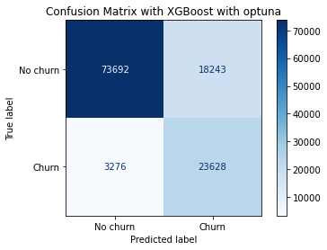
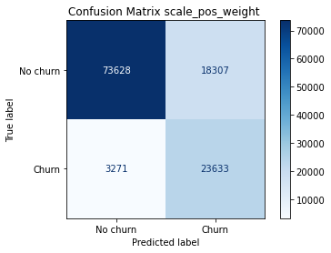
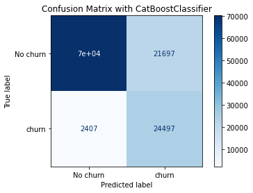
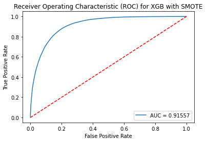
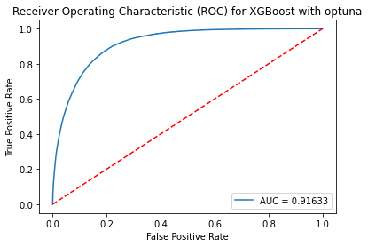
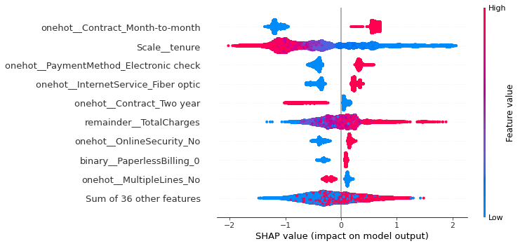
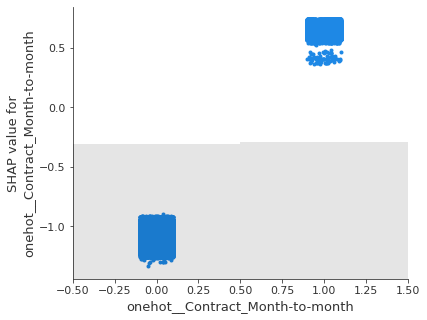

📊 Customer Churn Prediction using XGBoost & CatBoost
🧠 Project Overview

This project focuses on predicting customer churn using a highly imbalanced dataset, where the number of non-churned customers is significantly higher than churned customers.

To handle this imbalance and improve model performance, advanced machine learning techniques such as XGBoost, CatBoost, and ensemble learning were used.

🎯 Problem Statement

The goal is to predict whether a customer will churn (leave the service) based on their usage behavior and account information.

Since the dataset is highly imbalanced, special techniques were applied to ensure the model learns effectively from minority (churned) cases.

⚙️ Techniques Used
📌 Handling Class Imbalance
Class weighting using scale_pos_weight
Oversampling using SMOTE
🚀 Models Implemented
XGBoost Classifier
CatBoost Classifier
🔧 Hyperparameter Tuning

For XGBoost, two tuning strategies were compared:

RandomizedSearchCV
Optuna Optimization

The goal was to identify which method produces better ROC-AUC performance.

🤝 Ensemble Method

A soft voting ensemble was implemented by averaging prediction probabilities from:

Tuned XGBoost model
CatBoost model

This improved overall generalization and predictive performance.

📊 Model Evaluation Metrics

The models were evaluated using:

ROC-AUC Score
Confusion Matrix
Cross-validation (Stratified K-Fold)
Classification Metrics (Precision, Recall, F1-score)
📷 Results & Visualizations
🔹 Confusion Matrix (XGBoost)

 ### SMOTE Confusion Matrix
 
 ### XGBoost Optuna Confusion Matrix
 
 ### Scale Pos Weight Confusion Matrix
 
 ### CatBoost Confusion Matrix
 
🔹 ROC Curves

 ### CatBoost Confusion Matrix

### XGBoost Random Search ROC

### SMOTE ROC Curve

### XGBoost Optuna ROC

🔹 SHAP Feature Importance
 ### SHAP Summary (XGBoost Optuna)

### SHAP Dependence Plot

🔹 Final Ensemble Performance
Final ROC-AUC Score: 91.69
📁 Project Structure
Churn-Prediction/
│
├── code/
├── data/
├── EDA/
├── outputs/
├── README.md
├── requirements.txt
🛠️ Libraries Used
pandas
numpy
scikit-learn
xgboost
catboost
imbalanced-learn (SMOTE)
optuna
shap
matplotlib
seaborn
📌 Key Insights
Month-to-month contracts show higher churn rates
Lack of add-on services increases churn probability
Electronic check users are more likely to churn
Feature interactions significantly impact predictions (SHAP analysis confirms this)
🧠 Conclusion

This project demonstrates how advanced boosting algorithms combined with imbalance handling techniques and hyperparameter optimization can significantly improve churn prediction performance.

The final ensemble model provides better generalization compared to individual models.

🚀 Future Improvements
Deploy model using Streamlit / Flask
Add real-time prediction API
Experiment with stacking ensemble models
Feature engineering improvements
👨‍💻 Author

Mariya John
